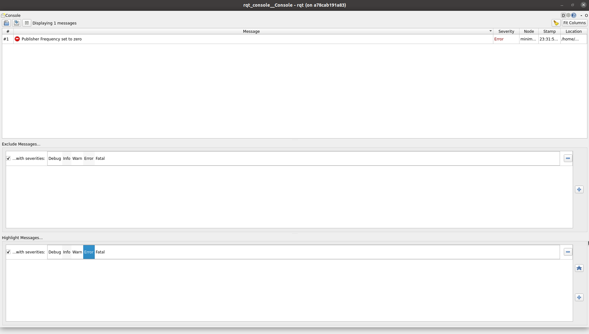
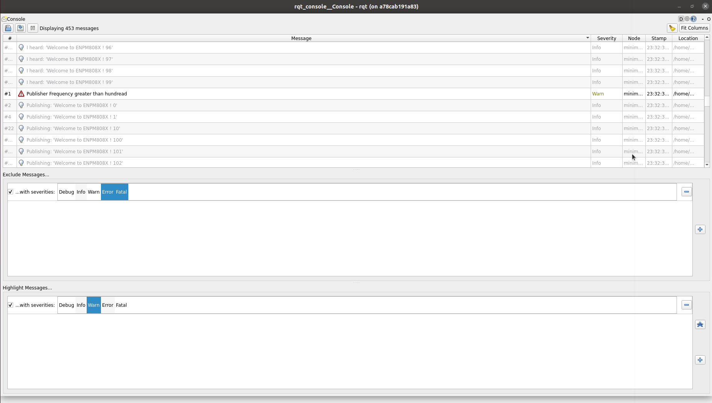
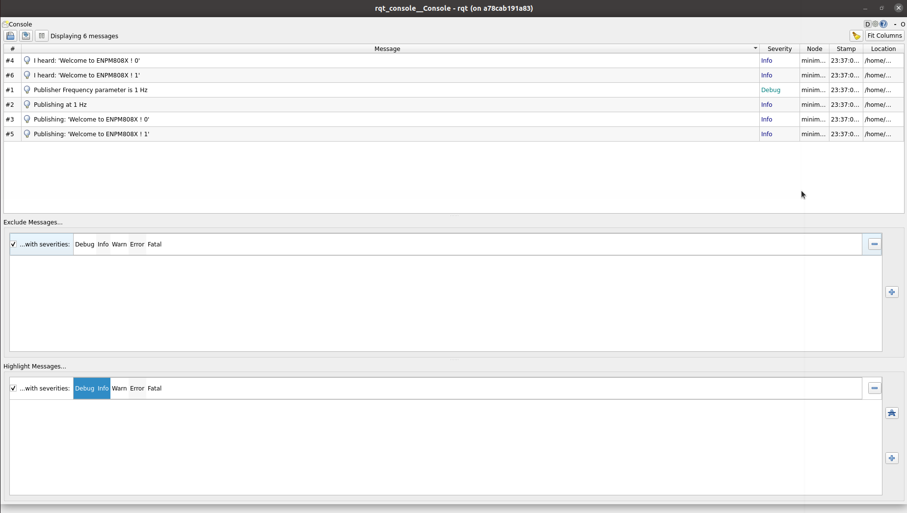

# beginner_tutorials

## Overview
This repository contains beginner tutorials in C++ for a publisher and subscriber node in ROS2 humble for custom string message. It has a launch files to launche publisher and subscriber nodes as well as to record rosbag. It also has a service in talker to modify the string message. Talker broadcasts a  static tf frame called /talk with parent /world. The transform has non-zero translation and rotation. The repository has unit tests for Talker node.

## Dependencies
* ROS 2 Humble
* Ubuntu 22.04

## Build Instructions
```
mkdir -p ~/ros2_ws/src
cd ~/ros2_ws/src

git clone https://github.com/NehaMadhekar09/beginner_tutorials.git

cd ..

rosdep install -i --from-path src --rosdistro humble -y

colcon build 

. install/setup.bash

```
## Run instructions
### 1. Go to directory
```
cd ros2_ws
```
### 2. Source the workspace
```
. install/setup.bash
```
### 3. To run talker and listener nodes
   
In terminal 1 
```
ros2 run beginner_tutorials talker
```
Open another terminal 2
```
. install/setup.bash
```
```
ros2 run beginner_tutorials listener
```
### 4. To run talker and listener nodes through launch file
```
. install/setup.bash
```
```
ros2 launch beginner_tutorials my_launch.py frequency:=5.0
```
### 5. To call ros service with modified request message

In terminal 1
```
. install/setup.bash
```
```
ros2 run beginner_tutorials talker
```

In terminal 2
```
. install/setup.bash
```
```
ros2 service call /custom_service beginner_tutorials/srv/ModifyService "{request_message: New Message}"

```
### 6. To check the broadcasted tf frames

In terminal 1, launch talker node
```
ros2 run beginner_tutorials talker
```

In terminal 2 for checking the frames transformation
```
ros2 run tf2_ros tf2_echo world talk
```
```
ros2 run tf2_tools view_frames
```
### 7. To run ROS tests
From ros2 workspace,
```
colcon test --event-handlers console_direct+ --packages-select beginner_tutorials
```

### 8. To record bag files with the launch file

#### Recording bag file
Run in ros2_ws directory
```
ros2 launch beginner_tutorials rosbag_launch.py record_rosbag:=True
```
Terminate after few seconds.

#### For viewing bag file information
```
ros2 bag info bag_list
```
#### For playing Rosbag
```
cd bag_list
```
Go to the directory where rosbag is located and play the rosbag.
For example,
```
ros2 bag play bag_list_0.db3
```
#### For running the listener node to get the recorded messages
Play rosbag in terminal 1
```
ros2 bag play bag_list_0.db3
```
In terminal 2,
```
ros2 run beginner_tutorials listener
```
#### Disable bag file recording
Run in ros2_ws directory
```
ros2 launch beginner_tutorials rosbag_launch.py record_rosbag:=False
```

## Results for Service with different log messages:

1. Frequency=-5


2. Frequency=0



3. Frequency=101



4. Frequency=1



## Results for TF Broadcasting 

TF Frames are [here](results/frames_2023-11-28_00.20.43.pdf)

## Recorded Rosbag

Recorded rosbag is [here](results/bag_list/)