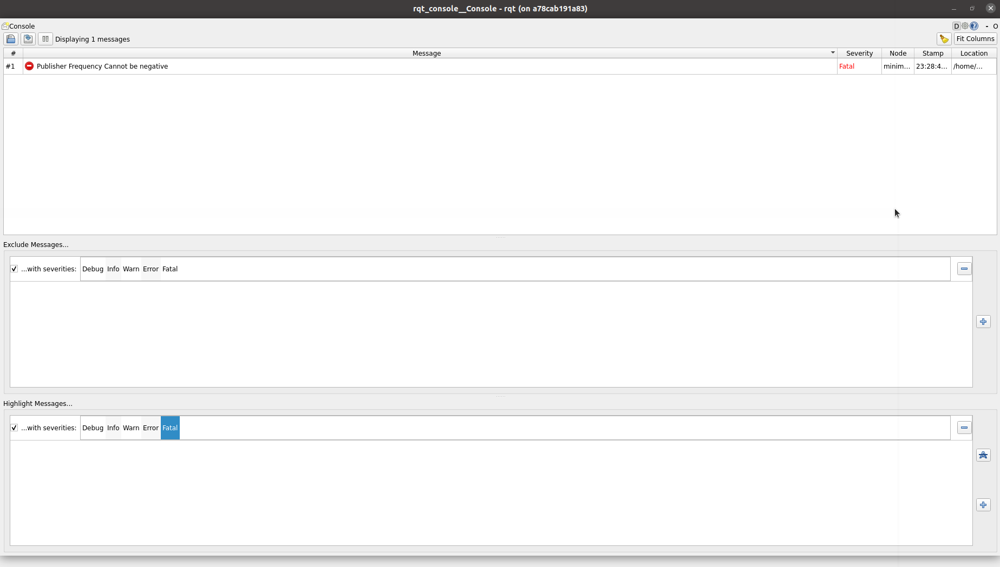

# beginner_tutorials

## Overview
This repository contains beginner tutorials in C++ for a publisher and subscriber node in ROS2 humble for custom string message. It has a launch file that launches publisher and subscriber nodes. It also has a service in talker to modify the string message.

## Dependencies
* ROS 2 Humble
* Ubuntu 22.04

## Build Instructions
```
mkdir -p ~/ros2_ws/src
cd ~/ros2_ws/src

git clone https://github.com/NehaMadhekar09/beginner_tutorials.git

cd ..

rosdep install -i --from-path src --rosdistro humble -y

colcon build 

. install/setup.bash

```
## Run instructions
1. Go to directory
```
cd ros2_ws
```
2. Source the workspace
```
. install/setup.bash
```
3. To run talker and listener nodes
   
In terminal 1 
```
ros2 run beginner_tutorials talker
```
Open another terminal 2
```
. install/setup.bash
```
```
ros2 run beginner_tutorials listener
```
4. To run talker and listener nodes through launch file
```
. install/setup.bash
```
```
ros2 launch beginner_tutorials my_launch.py frequency:=5.0
```
5. To call ros service with modified request message

In terminal 1
```
. install/setup.bash
```
```
ros2 run beginner_tutorials talker
```

In terminal 2
```
. install/setup.bash
```
```
ros2 service call /custom_service beginner_tutorials/srv/ModifyService "{request_message: New Message}"

```

## Results with different log messages:

1. Frequency=-5



2. Frequency=0

3. Frequency=101

4. Frequency=1

